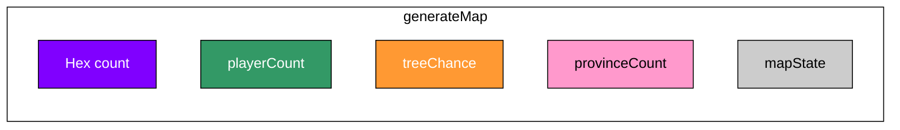

# ABI

### mapStateABI

```mermaid
flowchart LR
    subgraph mapStateABI
        A[Hex count]:::purple
        B[Player count]:::green
        C[Current player]:::lightblue
        D[Current round]:::navy
        E[Province count]:::pink
        F[Hex state]:::red
        G[Hex color]:::violet
        H[Province hex mapping]:::orange
        I[Max province finance]:::yellow
        J[Province finance state]:::darkgreen
    end

    classDef purple fill:#8000ff,stroke:#000,color:#fff;
    classDef green fill:#339966,stroke:#000,color:#fff;
    classDef lightblue fill:#66ccff,stroke:#000,color:#000;
    classDef navy fill:#003366,stroke:#000,color:#fff;
    classDef pink fill:#ff99cc,stroke:#000,color:#000;
    classDef red fill:#ff6666,stroke:#000,color:#000;
    classDef violet fill:#cc99ff,stroke:#000,color:#000;
    classDef orange fill:#ff9933,stroke:#000,color:#000;
    classDef yellow fill:#ffff66,stroke:#000,color:#000;
    classDef darkgreen fill:#009933,stroke:#000,color:#fff;
    style mapStateABI fill:none,stroke:#000,stroke-width:1px,color:#000;
```

---

### Map State ABI – Memory Layout

<table>
  <thead>
    <tr>
      <td><b>Field</b></td>
      <td><b>Size (Bits)</b></td>
      <td><b>Type</b></td>
      <td><b>Description</b></td>
      <td><b>Max Value / Range</b></td>
    </tr>
  </thead>
  <tbody>
    <tr>
      <td><b>Hex count</b></td>
      <td>24</td>
      <td><code>uint24</code></td>
      <td>Total number of hexes on the map.</td>
      <td>2,250,000</td>
    </tr>
    <tr>
      <td><b>Player count</b></td>
      <td>24</td>
      <td><code>uint24</code></td>
      <td>Number of players in the game.</td>
      <td>1,500</td>
    </tr>
    <tr>
      <td><b>Current player</b></td>
      <td>24</td>
      <td><code>uint24</code></td>
      <td>Index of the currently active player.</td>
      <td>1,500</td>
    </tr>
    <tr>
      <td><b>Current round</b></td>
      <td>32</td>
      <td><code>uint32</code></td>
      <td>Current round/turn number.</td>
      <td>4,294,967,295</td>
    </tr>
    <tr>
      <td><b>Province count</b></td>
      <td>32</td>
      <td><code>uint32</code></td>
      <td>Number of provinces (groups of hexes).</td>
      <td>2,250,000</td>
    </tr>
    <tr>
      <td><b>Hex state</b></td>
      <td>8 × (hex count)</td>
      <td><code>uint8[]</code></td>
      <td>Stores the state of each hex tile (terrain/building/unit).</td>
      <td>2,250,000 bytes</td>
    </tr>
    <tr>
      <td><b>Hex color</b></td>
      <td>⌈log₂(playerCount)⌉ × (hex count)</td>
      <td><code>bit-packed array</code></td>
      <td>
        Stores ownership of each hex.  
        Each hex stores the index of its owner (player ID).  
        The number of bits per hex is the minimum required to encode <code>playerCount</code>.  
        Example:  
        <ul>
          <li>playerCount = 1500 → ⌈log₂(1500)⌉ = 11 bits per hex</li>
          <li>playerCount = 1000 → 10 bits per hex</li>
        </ul>
      </td>
      <td>Dynamic (depends on player count)</td>
    </tr>
    <tr>
      <td><b>Province hex mapping</b></td>
      <td>⌈log₂(provinceCount)⌉ × (hex count)</td>
      <td><code>bit-packed array</code></td>
      <td>
        Maps each hex to a province ID.  
        The number of bits per hex is the minimum required to encode <code>provinceCount</code>.  
        Example:  
        <ul>
          <li>provinceCount = 200 → 8 bits per hex</li>
          <li>provinceCount = 1000 → 10 bits per hex</li>
        </ul>
      </td>
      <td>Dynamic (depends on province count)</td>
    </tr>
    <tr>
      <td><b>Max province finance</b></td>
      <td>32</td>
      <td><code>int32</code></td>
      <td>
        Stores the financial state of the wealthiest province.  
        Used to determine how many bits are needed for <b>Province finance state</b>.
      </td>
      <td>-2,147,483,648 → 2,147,483,647</td>
    </tr>
    <tr>
      <td><b>Province finance state</b></td>
      <td>⌈log₂(maxProvinceFinance)⌉ × (province count)</td>
      <td><code>bit-packed array</code></td>
      <td>
        Stores the financial state (gold/money) of each province.  
        The number of bits per province is the minimum required to encode the wealth of the richest province.  
        Example:  
        <ul>
          <li>max wealth = 200 → 8 bits per province</li>
          <li>max wealth = 50,000 → 16 bits per province</li>
          <li>max wealth = 2,000,000,000 → 31 bits per province</li>
        </ul>
      </td>
      <td>Dynamic (depends on richest province)</td>
    </tr>
  </tbody>
</table>

---

### Hex State Legend

Each hex tile is represented by **1 byte** that encodes its state:

- `0` – Empty  
- `1` – Castle  
- `2` – House  
- `3` – Watchtower  
- `4` – Keeptower  
- `5` – Peasant (ready)  
- `6` – Spearman (ready)  
- `7` – Mercenary (ready)  
- `8` – Knight (ready)  
- `9` – Peasant (break)  
- `10` – Spearman (break)  
- `11` – Mercenary (break)  
- `12` – Knight (break)  
- `13` – Cavalry  
- `14` – Tree
- `15` – Palm  

---

### generateMap

---

### generateMap – Memory Layout

<table>
  <thead>
    <tr>
      <td><b>Field</b></td>
      <td><b>Size (Bits)</b></td>
      <td><b>Type</b></td>
      <td><b>Description</b></td>
      <td><b>Max Value / Range</b></td>
    </tr>
  </thead>
  <tbody>
    <tr>
      <td><b>Hex count</b></td>
      <td>24</td>
      <td><code>uint24</code></td>
      <td>Total number of hexes on the map.</td>
      <td>2,250,000</td>
    </tr>
    <tr>
      <td><b>Player count</b></td>
      <td>16</td>
      <td><code>uint16</code></td>
      <td>Number of players in the game.</td>
      <td>1,500</td>
    </tr>
    <tr>
      <td><b>treeChance</b></td>
      <td>8</td>
      <td><code>uint8</code></td>
      <td>Chance of tree generation (0–100%).</td>
      <td>0–100</td>
    </tr>
    <tr>
      <td><b>Province count</b></td>
      <td>32</td>
      <td><code>uint32</code></td>
      <td>Number of provinces (groups of hexes).</td>
      <td>2,250,000</td>
    </tr>
    <tr>
      <td><b>mapState</b></td>
      <td>variable</td>
      <td><code>struct</code></td>
      <td>Pointer to the full <a href="#mapstateabi">mapState</a> structure.</td>
      <td>~7 GB (depending on map size)</td>
    </tr>
  </tbody>
</table>
