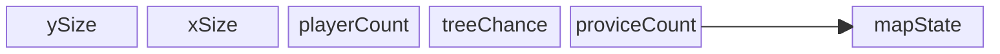

# Packets
### generateMap

ySize is a variable responsible for height of the map

xSize is a variable responsible for width of the map 

playerCount is a variable responsible for number of players in current game

