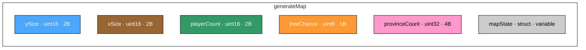
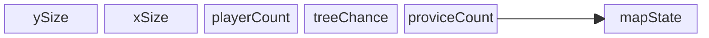

# ABI
### mapStateABI

```mermaid
flowchart LR
    subgraph mapStateABI
        A[Map height - <br> 2 Bytes]:::blue
        B[Map width - <br> 2 Bytes]:::brown
        C[Player count - <br> 2 Bytes]:::green
        D[Current player - <br> 2 Bytes]:::teal
        E[Current round - <br> 4 Bytes]:::lightblue
        F[Province count - <br> 4 Bytes]:::pink
        G[Hex state <br> 1 Byte * hex count]:::red
        H[Hex color - <br> 2 Bytes * hex count <br> 1 Byte * hex count]:::violet
        I[Hex finance state - <br> 4 Bytes * province count]:::darkgreen
    end

    classDef blue fill:#4da6ff,stroke:#000,color:#fff;
    classDef brown fill:#996633,stroke:#000,color:#fff;
    classDef green fill:#339966,stroke:#000,color:#fff;
    classDef teal fill:#006666,stroke:#000,color:#fff;
    classDef lightblue fill:#99ccff,stroke:#000,color:#000;
    classDef pink fill:#ff99cc,stroke:#000,color:#000;
    classDef red fill:#ff6666,stroke:#000,color:#000;
    classDef violet fill:#ffccff,stroke:#000,color:#000;
    classDef darkgreen fill:#009933,stroke:#000,color:#fff;
    style mapStateABI fill:#ffffff,stroke:#000,stroke-width:1px,color:#000;
```

### Map State ABI – Memory Layout

The diagram above represents the memory block responsible for storing the **Map State**.  
Each cell corresponds to a specific piece of information about the map, players, or game state.

### Map State ABI – Memory Layout

| Field                | Size (Bytes) | Type              | Description                                                                 | Max Value / Range                  |
|-----------------------|--------------|-------------------|-----------------------------------------------------------------------------|------------------------------------|
| **Map height**        | 2            | `uint16`          | Number of rows (vertical size of the map).                                  | 65,535                             |
| **Map width**         | 2            | `uint16`          | Number of columns (horizontal size of the map).                             | 65,535                             |
| **Player count**      | 2            | `uint16`          | Number of players in the game.                                              | 65,535                             |
| **Current player**    | 2            | `uint16`          | Index of the currently active player.                                       | 65,535                             |
| **Current round**     | 4            | `uint32`          | Current round/turn number.                                                  | 4,294,967,295                      |
| **Province count**    | 4            | `uint32`          | Number of provinces (groups of hexes).                                      | 4,294,967,295                      |
| **Hex state**         | 1 * (height × width) | `uint8[]`         | Stores the state of each hex tile (terrain/building/unit).                   | Max size: 4,294,967,225 bytes ≈ 4.29 GB |
| **Hex color**         | 2 * (height × width) | `uint16[]`        | Stores the color/ownership of each hex tile (2 bytes per hex).               | Max size: 8.59 GB                  |
|                       | 1 * (height × width) | `uint8[]`         | Alternative compact mode (1 byte per hex).                                  | Max size: 4.29 GB                  |
| **Hex finance state** | 4 * province count   | `int32[]`         | Stores the financial state (gold/money) of each province.                   | -2,147,483,648 to 2,147,483,647    |

### Hex State Legend

Each hex tile is represented by **1 byte** that encodes its state:

- `0` – Water
- `1` – Empty
- `2` – Castle
- `3` – House
- `4` – Watchtower
- `5` – Keep tower
- `6` – Peasant (ready)
- `7` – Spearman (ready)
- `8` – Mercenary (ready)
- `9` – Knight (ready)
- `10` – Peasant (break)
- `11` – Spearman (break)
- `12` – Mercenary (break)
- `13` – Knight (break)
- `14` – Cavalry
- `15` – Tree
### generateMap

ySize is a variable responsible for height of the map

xSize is a variable responsible for width of the map

playerCount is a variable responsible for number of players in current game

