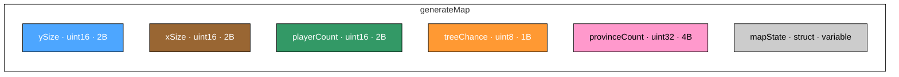
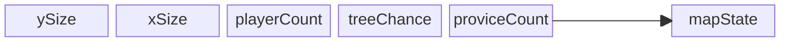

# ABI
### mapStateABI

```mermaid
flowchart LR
    subgraph mapStateABI
        A[Map height - <br> 2 Bytes]:::blue
        B[Map width - <br> 2 Bytes]:::brown
        C[Player count - <br> 2 Bytes]:::green
        D[Current player - <br> 2 Bytes]:::teal
        E[Current round - <br> 4 Bytes]:::lightblue
        F[Province count - <br> 4 Bytes]:::pink
        G[Hex state <br> 1 Byte * hex count]:::red
        H[Hex color - <br> 2 Bytes * hex count <br> 1 Byte * hex count]:::violet
        I[Hex finance state - <br> 4 Bytes * province count]:::darkgreen
    end

    classDef blue fill:#4da6ff,stroke:#000,color:#fff;
    classDef brown fill:#996633,stroke:#000,color:#fff;
    classDef green fill:#339966,stroke:#000,color:#fff;
    classDef teal fill:#006666,stroke:#000,color:#fff;
    classDef lightblue fill:#99ccff,stroke:#000,color:#000;
    classDef pink fill:#ff99cc,stroke:#000,color:#000;
    classDef red fill:#ff6666,stroke:#000,color:#000;
    classDef violet fill:#ffccff,stroke:#000,color:#000;
    classDef darkgreen fill:#009933,stroke:#000,color:#fff;
    style mapStateABI fill:none,stroke:#000,stroke-width:1px,color:#000;
```
### Map State ABI – Memory Layout

The diagram above represents the memory block responsible for storing the **Map State**.  
Each cell corresponds to a specific piece of information about the map, players, or game state.

### Map State ABI – Memory Layout

<table>
  <thead>
    <tr>
      <td>Field</td>
      <td>Size (Bytes)</td>
      <td>Type</td>
      <td>Description</td>
      <td>Max Value / Range</td>
    </tr>
  </thead>
  <tbody>
    <tr>
      <td><b>Map height</b></td>
      <td>2</td>
      <td><code>uint16</code></td>
      <td>Number of rows (vertical size of the map).</td>
      <td>65,535</td>
    </tr>
    <tr>
      <td><b>Map width</b></td>
      <td>2</td>
      <td><code>uint16</code></td>
      <td>Number of columns (horizontal size of the map).</td>
      <td>65,535</td>
    </tr>
    <tr>
      <td><b>Player count</b></td>
      <td>2</td>
      <td><code>uint16</code></td>
      <td>Number of players in the game.</td>
      <td>65,535</td>
    </tr>
    <tr>
      <td><b>Current player</b></td>
      <td>2</td>
      <td><code>uint16</code></td>
      <td>Index of the currently active player.</td>
      <td>65,535</td>
    </tr>
    <tr>
      <td><b>Current round</b></td>
      <td>4</td>
      <td><code>uint32</code></td>
      <td>Current round/turn number.</td>
      <td>4,294,967,295</td>
    </tr>
    <tr>
      <td><b>Province count</b></td>
      <td>4</td>
      <td><code>uint32</code></td>
      <td>Number of provinces (groups of hexes).</td>
      <td>4,294,967,295</td>
    </tr>
    <tr>
      <td><b>Hex state</b></td>
      <td>1 * (height × width)</td>
      <td><code>uint8[]</code></td>
      <td>Stores the state of each hex tile (terrain/building/unit). Max size: 4,294,967,225 bytes ≈ 4.29 GB</td>
      <td></td>
    </tr>
    <tr>
      <td =><b>Hex color</b></td>
      <td>(1 or 2) * (height × width)</td>
      <td><code>uint8[] or uint16[]</code></td>
      <td>Stores the color/ownership of each hex tile. (1 byte per hex, when player count &lt; 256) Alternative (2 bytes per hex, when player count &gt;= 256). Max size: 8.59 GB</td>
      <td></td>
    </tr>
    <tr>
      <td></td>
      <td><code>uint8[]</code></td>
      <td>Alternative compact mode (1 byte per hex). Max size: 4.29 GB</td>
      <td></td>
    </tr>
    <tr>
      <td><b>Hex finance state</b></td>
      <td>4 * province count</td>
      <td><code>int32[]</code></td>
      <td>Stores the financial state (gold/money) of each province.</td>
      <td>-2,147,483,648 to 2,147,483,647</td>
    </tr>
  </tbody>
</table>

### Hex State Legend

Each hex tile is represented by **1 byte** that encodes its state:

- `0` – Water
- `1` – Empty
- `2` – Castle
- `3` – House
- `4` – Watchtower
- `5` – Keep tower
- `6` – Peasant (ready)
- `7` – Spearman (ready)
- `8` – Mercenary (ready)
- `9` – Knight (ready)
- `10` – Peasant (break)
- `11` – Spearman (break)
- `12` – Mercenary (break)
- `13` – Knight (break)
- `14` – Cavalry
- `15` – Tree
### generateMap

```mermaid
flowchart LR
    subgraph generateMap [generateMap]
        direction TB
        A[ySize · uint16 · 2B]:::blue
        B[xSize · uint16 · 2B]:::brown
        C[playerCount · uint16 · 2B]:::green
        D[treeChance · uint8 · 1B]:::orange
        E[provinceCount · uint32 · 4B]:::pink
        F[mapState · struct · variable]:::gray
    end

    classDef blue fill:#4da6ff,stroke:#000,color:#fff;
    classDef brown fill:#996633,stroke:#000,color:#fff;
    classDef green fill:#339966,stroke:#000,color:#fff;
    classDef orange fill:#ff9933,stroke:#000,color:#fff;
    classDef pink fill:#ff99cc,stroke:#000,color:#000;
    classDef gray fill:#cccccc,stroke:#000,color:#000;

    style generateMap fill:#ffffff,stroke:#000,stroke-width:1px,color:#000;```
```

```mermaid
block-beta
    ySize xSize playerCount treeChance proviceCount space mapState
    ySize xSize playerCount treeChance proviceCount --> mapState
```

ySize is a variable responsible for height of the map

xSize is a variable responsible for width of the map

playerCount is a variable responsible for number of players in current game

## Functions
<code>mapGenerate(int16 arg1): [mapState](#mapstateabi) </code>: Generates map with given dimenstions, returns pointer to [`mapState`](#mapstateabi).

`mapGenerate(int16 arg1): mapState`: Generates map with given dimenstions, returns pointer to [`mapState`](#mapstateabi).

`mapGenerate(int16 arg1): mapState`: Generates map with given dimenstions, returns pointer to [`mapState`](#mapstateabi).

`mapGenerate(int16 arg1): mapState`: Generates map with given dimenstions, returns pointer to [`mapState`](#mapstateabi).
